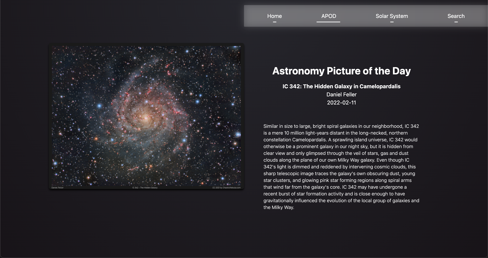

# Space


This web application is a portfolio website where I experiment with different technologies, along with improving plain css and javascript.
This site contains a Home page, a Picture of the Day page, Solar System page and a Search page.

It uses NASA API's to fetch information, both for the picture of the day and for searching the nasa image and video library.





## Getting started

1. Clone the repo

```
git clone https://github.com/xReubeNx/Space.git
cd app
```

2. Install dependencies
```
npm install
```

3. Run the app
```
npm run dev
```

## Tech Stack

Next.js, Tailwind and Sass